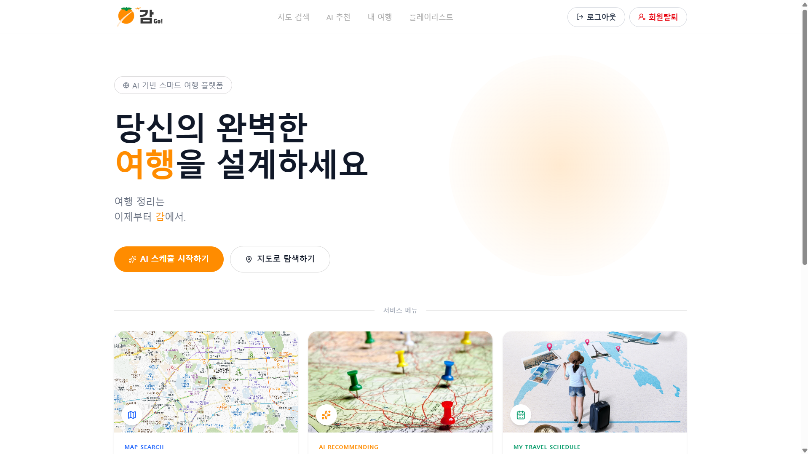
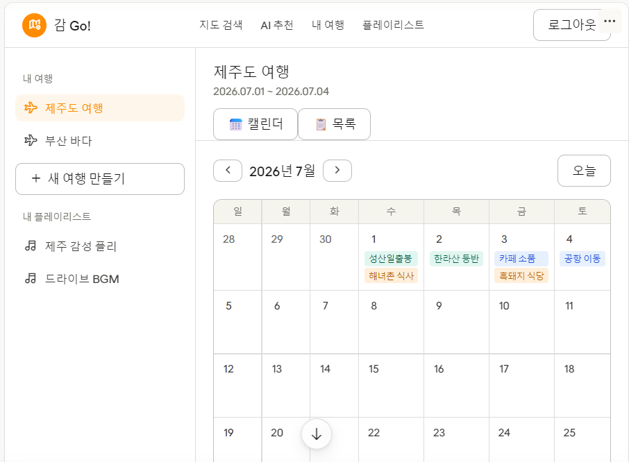

# 감(go!)
AI 기반 여행 일정 편성 플랫폼입니다.

## 💡 기획 배경

**기존 방식의 비효율**

- 여행을 가기 위해 정보 파편화(앱마다 따로 검색)
- 이중 작업(메모장에 수동 취합)
- 맞춤형 서비스의 한계로 인해 사용자 편의성이 매우 저조함

**원스톱 플랫폼 솔루션**

- 숙박·음식점·길 안내·일정 관리·음악 큐레이션까지 단 하나의 화면에서 완벽하게 처리 가능한 사용자 통합 플랫폼 구현

## 💻 Preview

- **메인 화면**
  
  

  - 여행지 검색, 여행지 추천, 마이페이지, 플레이리스트 페이지로 이동
  - 로그아웃, 회원탈퇴 기능
  
- **여행지 검색**
  
  

  - 여행지 검색
  - 맛집, 숙소, 관광지 검색
  - 맛집, 숙소, 관광지를 일정에 추가
  
- **AI 기반 여행지 추천**
  
  

  - 선택한 취향을 기반으로 AI가 여행지 추천

- **AI 기반 플레이리스트 추천**
  
  

  - 가수 입력 후 플레이리스트 생성
  - 생성 된 플레이리스트 저장

- **마이페이지**
  
  

  - 여행 만들기
  - 여행 확인
  - 여행 수정 및 삭제
  - 플레이리스트 확인
  - 플레이리스트 수정 및 삭제
  - 네비게이션 구현
  
- **여행 만들기**
  
  

  - 여행 이름 지정
  - 날짜 지정 후 여행 생성
  
## 🛠️ Tech Stack

  - FrontEnd
  
    
    
    
    

  - Development Tools

    
    
    

## 🗺️ User Flow

1. 접속 → 로그인 / 회원가입
   - 신규 사용자 → 회원가입 → 로그인
   - 기존 사용자 → 닉네임, 비밀번호로 로그인
2. 메인 화면 진입
   - 지도 검색 페이지 → 여행지 검색 → 맛집, 숙소, 관광지를 일정에 추가
   - AI 기반 여행지 추천 페이지 → 선택한 취향을 기반으로 여행지 추천
   - 마이페이지
      - 여행 없음 → 여행 생성 페이지 → 여행 이름, 기간을 지정하고 여행 생성
      - 여행 있음 → 일정 확인 / 수정 / 삭제
      - 플레이리스트 확인 / 수정 / 삭제
   - AI 기반 플레이리스트 생성 페이지 → 가수 이름 입력 → 플레이리스트 생성 → 저장

## 🐛 Trouble Shooting

### 비밀번호 UI 공통화
   - 문제
     - 회원가입과 재설정 페이지의 비밀번호 입력 UI 디자인 중복 확인 
   - 해결
     - 디자인 및 유효성 검사 로직을 하나의 공통 컴포넌트로 분리해 재사용성 대폭 확보

### 다단계 상태 보존
   - 문제
     - 회원가입 페이지에서 닉네임 ➔ 비밀번호 설정 페이지로 라우팅 시 닉네임 데이터 전달 문제 
   - 해결
     - SignUpPage 부모 컴포넌트 내 step state 기반 동적 처리로 이전 입력값 통합 안전 전송

### 회원가입 문제 해결
   - 문제
     - 이메일 인증 페이지에서 인증 완료 후 회원가입 페이지로 전달한 email이 새로고침 시 데이터가 유실되는 문제 발생
   - 해결
     - sessionStorage()를 활용해 새로고침해도 email 데이터가 유실되지 않게 끔 설계

### 지도 마커가 찍히지 않는 문제
   - 문제
     - 카카오맵 초기화보다 API 응답이 먼저 오면 마커가 렌더링되지 않는 타이밍 문제
   - 해결
     - sessionStorage()를 활용해 새로고침해도 email 데이터가 유실되지 않게 끔 설계

### 회원가입 문제 해결
   - 문제
     - 이메일 인증 페이지에서 인증 완료 후 회원가입 페이지로 전달한 email이 새로고침 시 데이터가 유실되는 문제 발생
   - 해결
     `MapView.tsx`에서 지도 준비 여부를 별도 state로 관리해 마커 effect의 의존성에 추가

        ```typescript
        const [mapReady, setMapReady] = useState(false);

        // 초기화 완료 시
        window.kakao.maps.load(() => {
            mapRef.current = new window.kakao.maps.Map(...);
            setMapReady(true);
        });

        // 마커 effect
        useEffect(() => {
            if (!mapReady || !mapRef.current) return;
            // 마커 렌더링
        }, [places, mapReady]);
        ```

### 일정 수정 후 화면이 갱신되지 않을 때
   - 문제
     - `refetch`가 제대로 연결되지 않은 경우 발생
   - 해결
     - React DevTools에서 `useTripSchedules`의 `tick` state 값이 수정 완료 후 증가하는지 확인
     - `NotionCalendar`와 목록 뷰 모두 `onEditSaved`에 `refetch`가 올바르게 연결되어 있는지 확인

## 🎯 기대 효과
   - 체계적인 여행 계획 편성
   - 원스톱 플랫폼으로 숙박·음식점·길 안내·일정 관리·플레이리스트 관리 까지 한번에 관리 가능

## 향후 개선
   - 최신 트렌드에 맞도록 디자인 개선

## 환경 변수

.env 파일을 생성하고 아래 값을 입력하세요.

VITE_KAKAO_MAP_KEY=카카오맵_API_키
   
## 실행 방법
```
npm install
npm run dev
```


